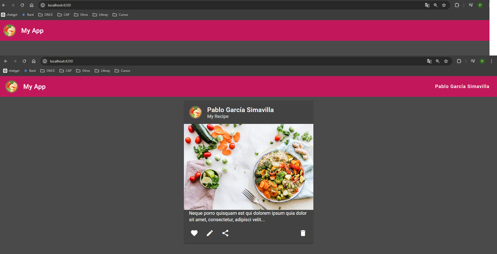
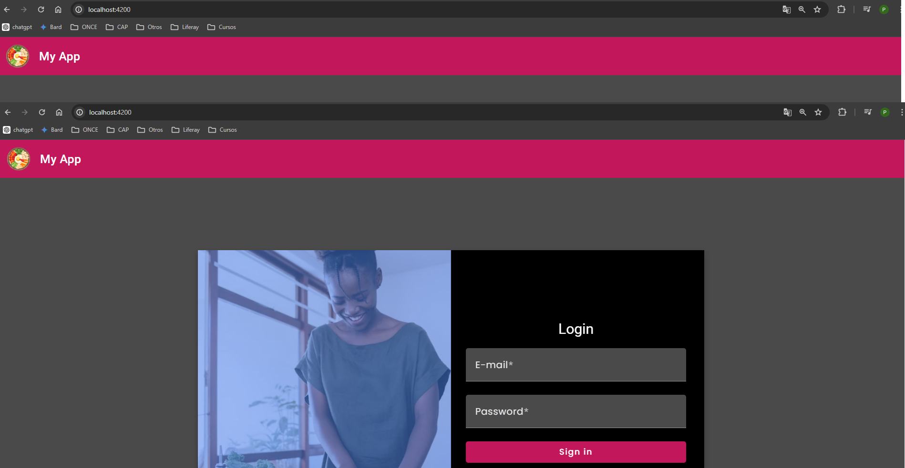

# Proyecto de Gestión de Inventario

Este proyecto tiene como objetivo desarrollar una aplicación de gestión de inventario que integra tecnologías modernas tanto en el backend como en el frontend. Utilizaremos Spring Boot para construir los servicios backend, comunicándonos con una base de datos MySQL y asegurando la autenticación del sistema mediante Keycloak, el cual será implementado en contenedores Docker.
La aplicación incluye un CRUD (Crear, Leer, Actualizar y Eliminar) para categorías y productos con paginación, búsqueda de productos por nombre y categoría por ID, así como exportación de listados en formato Excel.


## Tecnologías utilizadas en el backend:

- **Spring Boot 3**: Framework para la creación rápida de aplicaciones Java.
- **APIs REST**: Para exponer los datos al cliente en formato JSON.
- **Keycloak**: Para la autenticación y autorización de usuarios.
- **Docker**: Para la contenerización y distribución de la aplicación y servicios asociados.
- **MySQL**: Base de datos relacional para almacenar y gestionar los datos.

## Tecnologías utilizadas en el frontend:

- **Angular 16**: Framework para la construcción de interfaces de usuario modernas y eficientes.
- **Angular Material**: Framework basado en Material Design para el diseño y desarrollo de pantallas.
- **ChartJS**: Librería para la visualización de datos a través de gráficos.
- **Exportación a Excel con POI**: Para generar archivos Excel con los datos del inventario.

## Otros conocimientos adquiridos:

- **Git y GitHub**: Para el control de versiones y colaboración en el desarrollo del proyecto.
- **Gitflow**: Metodología de ramificación para el desarrollo colaborativo con Git.
- **Kanban**: Metodología de gestión visual de proyectos.
- **Trello**: Herramienta de gestión de proyectos basada en tableros Kanban.
- **Confluence**: Plataforma de colaboración para la documentación del proyecto.
- **HTML y CSS**: Para la estructura y estilización de las interfaces de usuario.

## Interfaces

A continuación se muestran algunas capturas de pantalla de la interfaz de usuario de la aplicación:

### Login


### Home


### Categorías CRUD


### Productos CRUD


## Keycloak

[Enlace a la imagen de Keycloak](https://hub.docker.com/repository/docker/pabgarsi/spring_angular/general)

### Instrucciones para configurar Keycloak:

1. **Crear Realm**: 
   - Inicia sesión en Keycloak como administrador.
   - Ve a la sección de "Realms" y haz clic en "Add realm".
   - Ingresa el nombre del realm y haz clic en "Create".

2. **Importar configuración de Keycloak**:
   - Descarga el archivo JSON de configuración de Keycloak desde [este enlace](./realm-export.json).
   - En la sección de "Realm Settings", haz clic en "Import" y selecciona el archivo JSON descargado.
   - Haz clic en "Import".

3. **Crear Usuarios**:
   - Ve a la sección de "Users" y haz clic en "Add user".
   - Ingresa los detalles del usuario admin y haz clic en "Save".
   - Repite el proceso para crear el usuario user.

4. **Descargar la imagen de Keycloak desde DockerHub**:
   - Abre una terminal o línea de comandos.
   - Ejecuta el siguiente comando para descargar la imagen de Keycloak desde DockerHub:

     ```
     docker pull pabgarsi/spring_angular:keycloak-24.0.3
     ```
